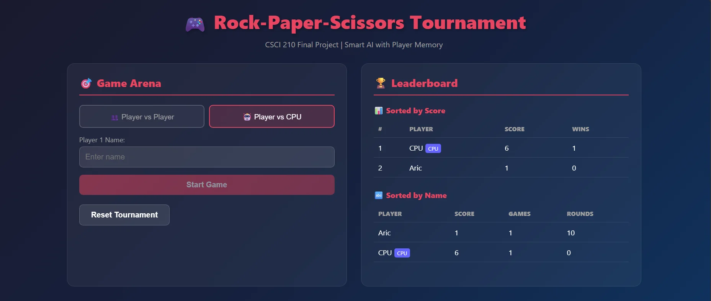
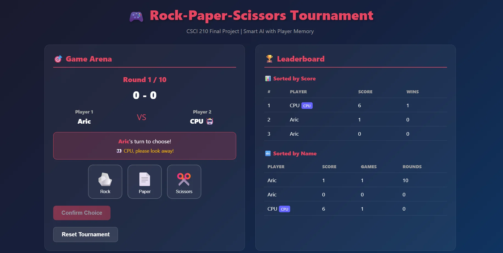

# Rock-Paper-Scissors Tournament Leaderboard

A Flask-based web application for managing a persistent, multi-player Rock-Paper-Scissors tournament. Built as the final project for CSCI 210 to demonstrate proficiency in Python data structures (Dictionary, List) and algorithms (Sorting, Searching).

[](https://www.python.org/downloads/)
[](https://flask.palletsprojects.com/)
[](LICENSE)

## 📋 Table of Contents

- [Features](#features)
- [Demo](#demo)
- [Installation](#installation)
- [Quick Start](#quick-start)
- [Game Modes](#game-modes)
- [Technical Implementation](#technical-implementation)
- [API Documentation](#api-documentation)
- [Documentation](#documentation)
- [Project Structure](#project-structure)
- [Academic Requirements](#academic-requirements)
- [Contributing](#contributing)
- [License](#license)

## ✨ Features

### Core Functionality

- 🎮 **Two Game Modes**: Player vs Player (PvP) and Player vs CPU
- 🏆 **Global Leaderboard**: Track unlimited unique players
- 💾 **Persistent Storage**: JSON-based data persistence with automatic backups
- 🔒 **Data Integrity**: SHA-256 checksums and backup system
- 🔄 **Winner Retention**: Automatic promotion of winners to next game
- 📊 **Dual Sorted Views**: Leaderboard sorted by name and score

### User Experience

- 🎯 **Turn-Based Gameplay**: Privacy mechanics for fair PvP matches
- 📱 **Responsive Design**: Works on desktop, tablet, and mobile
- 🌐 **Cross-Browser Compatible**: Tested on Chrome, Firefox, Safari, and Edge
- ⚡ **Real-Time Updates**: Dynamic UI updates without page reloads
- 🎨 **Modern UI**: Clean, intuitive interface with visual feedback

### Technical Features

- 🔌 **RESTful API**: Four well-defined endpoints for game management
- 📦 **Modular Architecture**: Separation of concerns between backend and frontend
- 🛡️ **Error Handling**: Comprehensive error checking and recovery
- 📈 **O(1) Lookups**: Efficient dictionary-based player data access
- 🔧 **Easy Deployment**: Simple Flask application with minimal dependencies

## 🎥 Demo

**Demo Video**: [Watch on YouTube](https://youtu.be/HTyoQWEXSTY)

### Screenshots

**Main Interface - Game Setup**



The initial interface showing game mode selection (Player vs Player and Player vs CPU), player name input, and the dual-sorted leaderboard display.

**Active Game - Turn-Based Play**



The game interface during an active match, showing the turn indicator, privacy mechanics ("CPU, please look away!"), choice buttons (Rock, Paper, Scissors), and real-time score tracking.

## 🚀 Installation

### Prerequisites

- Python 3.7 or higher
- pip (Python package installer)
- Git

### Clone the Repository

```bash
git clone https://github.com/aturs3001/rock_paper_scissors.git
cd rock_paper_scissors
```

### Install Dependencies

```bash
pip install -r requirements.txt
```

## ⚡ Quick Start

1. **Start the Flask server:**

```bash
python app.py
```

2. **Open your browser and navigate to:**

```
http://localhost:5000
```

3. **Start playing:**
   - Choose a game mode (PvP or CPU)
   - Enter player names
   - Click "Start Game"
   - Make your selections and enjoy!

## 🎮 Game Modes

### Player vs Player (PvP)

Two human players compete head-to-head with turn-based gameplay:

- Player 1 makes their choice (hidden from Player 2)
- Player 1 locks their selection
- Player 2 makes their choice
- Player 2 locks their selection
- Round result is revealed
- Privacy mechanics ensure fair play

### Player vs CPU

Single-player mode against a computer opponent:

- Enter your name and start playing
- CPU makes random selections with equal probability
- Instant gameplay with no waiting
- Same scoring rules as PvP mode

## 🔧 Technical Implementation

### Data Structures

#### 1. Central Data Store: Dictionary

```python
LEADERBOARD = {
    "PlayerName": {
        "score": 45,
        "games_won": 3
    }
}
```

- **Time Complexity**: O(1) for lookups and updates
- **Purpose**: Single source of truth for all player data

#### 2. Leaderboard Lists & Sorting

```python
# Convert to list
players_list = [{"name": name, **stats} for name, stats in LEADERBOARD.items()]

# Sort alphabetically
sorted_by_name = sorted(players_list, key=lambda x: x['name'])

# Sort by score (descending)
sorted_by_score = sorted(players_list, key=lambda x: x['score'], reverse=True)
```

- **Time Complexity**: O(n log n) for sorting
- **Purpose**: Generate two distinct sorted views

### Game Logic

- Each game consists of **10 rounds**
- Winner determination follows standard RPS rules
- Scores accumulate across all games
- Winner retention: Winner of each game becomes Player 1 for the next match

### Data Persistence

**Storage System:**

- JSON file-based storage (`leaderboard_data.json`)
- SHA-256 checksums for integrity verification
- Automatic backup before each save
- Atomic write operations to prevent corruption

**Files Generated:**

- `leaderboard_data.json` - Current data
- `leaderboard_data.json.backup` - Previous version
- `leaderboard_data.json.checksum` - Hash verification

## 📡 API Documentation

### Endpoints

#### POST `/api/player/register`

Register a new player in the tournament.

**Request:**

```json
{
  "name": "PlayerName"
}
```

**Response:**

```json
{
  "success": true,
  "message": "Player registered successfully"
}
```

#### POST `/api/game/start`

Initialize a new 10-round game.

**Request:**

```json
{
  "player1": "Alice",
  "player2": "Bob",
  "mode": "pvp"
}
```

**Response:**

```json
{
  "success": true,
  "game_id": "unique-game-id",
  "rounds_total": 10
}
```

#### POST `/api/game/play_round`

Execute one round and update scores.

**Request:**

```json
{
  "player1_choice": "rock",
  "player2_choice": "scissors"
}
```

**Response:**

```json
{
  "success": true,
  "winner": "Alice",
  "player1_score": 4,
  "player2_score": 3,
  "round_number": 7
}
```

#### GET `/api/leaderboard`

Retrieve the complete leaderboard with both sorted views.

**Response:**

```json
{
  "success": true,
  "leaderboard_by_name": [...],
  "leaderboard_by_score": [...]
}
```

## 📚 Documentation

For detailed instructions on running and testing the application, see the comprehensive User Manual:

**📖 [User Manual - GitHub Wiki](https://github.com/aturs3001/rock_paper_scissors/wiki/User-Manual)**

The User Manual includes:

- Step-by-step installation guide
- Detailed usage instructions
- API documentation with examples
- Troubleshooting guide
- Testing procedures
- Technical implementation details

## 📁 Project Structure

```
rock_paper_scissors/
├── app.py                          # Main Flask application
├── requirements.txt                # Python dependencies
├── README.md                       # This file
├── leaderboard_data.json          # Persistent data storage
├── leaderboard_data.json.backup   # Automatic backup
├── leaderboard_data.json.checksum # Data integrity hash
├── static/
│   ├── css/
│   │   └── style.css              # Application styles
│   └── js/
│       └── game.js                # Frontend game logic
├── templates/
│   └── index.html                 # Main application page
└── screenshots/                   # Demo screenshots
```

## ✅ Academic Requirements

This project fulfills all CSCI 210 Final Project requirements:

### Data Structures

- ✅ **Dictionary (LEADERBOARD)**: O(1) player lookup and updates
- ✅ **List**: Conversion for leaderboard display
- ✅ **Sorting**: Two sorted views (alphabetically and by score)
- ✅ **Searching**: Efficient player data retrieval

### Game Logic

- ✅ **10-Round Games**: Each game consists of exactly 10 rounds
- ✅ **Winner Retention**: Winner becomes locked Player 1 for next game
- ✅ **Score Accumulation**: Persistent tracking across all games
- ✅ **Multiple Players**: Supports unlimited unique players

### RESTful API

- ✅ **POST** `/api/player/register` - Create player resource
- ✅ **POST** `/api/game/start` - Initialize game state
- ✅ **POST** `/api/game/play_round` - Execute round and update scores
- ✅ **GET** `/api/leaderboard` - Retrieve sorted leaderboard data

### Leaderboard Display

- ✅ **Section 1**: Sorted alphabetically by player name
- ✅ **Section 2**: Sorted numerically by accumulative score (descending)
- ✅ **JSON Consumption**: Frontend consumes API endpoint
- ✅ **Dynamic Updates**: Real-time leaderboard updates

## 🤝 Contributing

This is an academic project for CSCI 210. While contributions are not actively sought, feedback and suggestions are welcome.

### Development Setup

1. Fork the repository
2. Create a feature branch (`git checkout -b feature/AmazingFeature`)
3. Commit your changes (`git commit -m 'Add some AmazingFeature'`)
4. Push to the branch (`git push origin feature/AmazingFeature`)
5. Open a Pull Request

## 📝 License

This project is licensed under the MIT License - see the [LICENSE](LICENSE) file for details.

## 👤 Author

**Aric**

- GitHub: [@aturs3001](https://github.com/aturs3001)
- Project Link: [https://github.com/aturs3001/rock_paper_scissors](https://github.com/aturs3001/rock_paper_scissors)

## 🙏 Acknowledgments

- CSCI 210 - Data Structures and Algorithms
- Flask Web Framework
- Professor and course materials for project requirements
- All playtesters who helped refine the user experience

## 🐛 Known Issues

None currently. For bug reports, please open an issue on GitHub.

## 🔮 Future Enhancements

Potential improvements for future versions:

- Tournament bracket system
- Player statistics dashboard with win/loss ratios
- Multiplayer online functionality with WebSockets
- Advanced CPU AI with pattern recognition
- Player profiles with avatars
- Match history and replay system
- Best-of-3 or best-of-5 game modes
- Mobile app version

---

**Built with ❤️ for CSCI 210**
